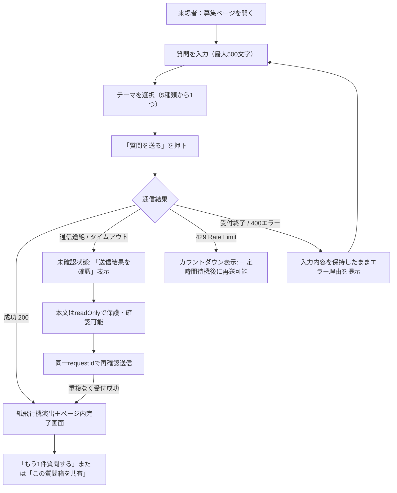
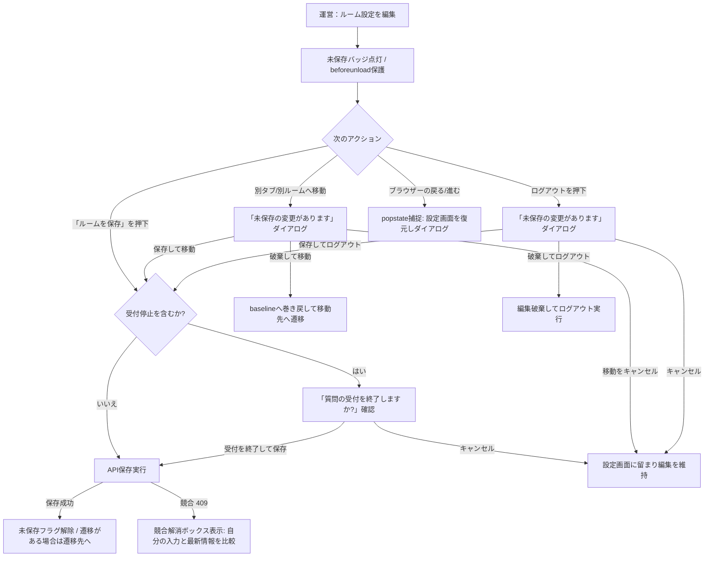
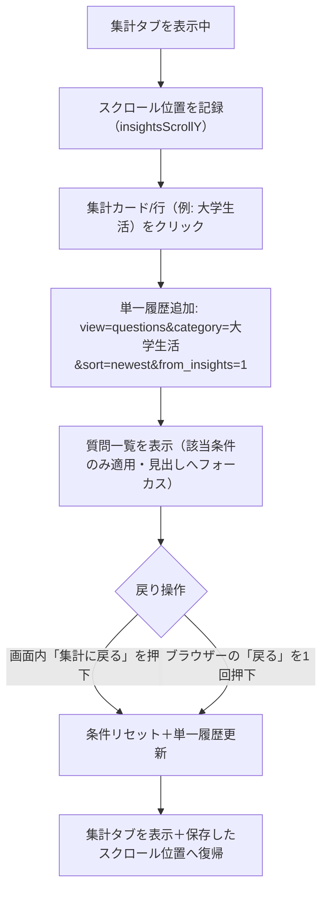

# 明学の質問箱 UI/UXコンポーネント・画面状態仕様書

作成日：2026-10-01　更新日：2026-10-02  
対象：来場者画面、運営画面、共通UIコンポーネント（13種類）

---

## 1. 13種類の基本UIコンポーネント状態網羅一覧

| No | コンポーネント | 通常（Default） | 選択（Selected / Active） | 待機（Busy / Loading） | 無効（Disabled） | エラー（Error） | 長文・限界値（Long Text） |
|---|---|---|---|---|---|---|---|
| 1 | **ボタン** | Primary / Secondary / Quiet / Dark / Danger。操作領域48px以上 | ナビでは現在地を文字・背景・aria-currentで示す | disabledとスピナー、処理に合ったラベル | 不透明な淡色面と文字。ネイティブdisabledで起動抑止 | 再試行ボタンとして連携 | 省略せず折り返す |
| 2 | **入力欄** | 常時ラベル・16px本文 | 2pxフォーカス枠 | 送信中はdisabled | 未確認本文はreadOnlyで選択可能 | 入力検証はaria-invalid・説明の関連づけ、空欄へフォーカス | 質問500文字、ルーム名・日時各100文字 |
| 3 | **テーマ選択** | 5テーマ。初期値は大学生活 | RadioGroup・矢印キー・黄色背景 | 送信中はdisabled | 受付終了・未確認時はdisabled | 必ず1テーマを選択した状態を維持 | ラベルを折り返す |
| 4 | **絞り込み** | テーマ・表示条件・並び順 | radioと矢印キー、適用条件表示 | API取得中表示。条件変更は可能 | 0件でも解除操作可能 | 再試行。更新失敗時は取得済み一覧を維持 | 条件を表示し一括解除可能 |
| 5 | **受付スイッチ** | 48×28px、thumb22px、移動20px | ON/OFFと状態説明 | 保存中はdisabled | ごみ箱はdisabled、アーカイブは設定編集可能 | 競合内容を別枠で表示 | 説明は折り返し、クリック可能なラベル全体64px以上 |
| 6 | **ナビゲーション** | 質問・集計・設定。768px未満は下部固定 | aria-current・アイコン・文字 | 設定保存中の離脱を保護 | ログイン前は非表示 | 通信障害でも維持 | 拡大時も本文と固定ナビの領域を分離 |
| 7 | **質問カード** | テーマ名・時刻・全文・流入元 | お気に入りのaria-pressed | 楽観的更新、同じ質問への重複更新を抑止 | 受付終了後も閲覧可能 | 失敗時は状態を復元 | 500文字全文を折り返し表示 |
| 8 | **お気に入り・取消** | 48px操作領域、線の星 | 黄色面と濃い輪郭、aria-pressed | 通信中は同一質問への処理を抑止 | 認証前は非表示 | 更新失敗で復元・通知 | 解除した各カードに取消操作を残す。カード順序を維持 |
| 9 | **集計項目** | 全件・テーマ・日付・流入元 | 該当する質問へ進む操作名 | 15秒ごとの更新 | 0件では内訳案内 | 取得失敗時の通知・再試行 | 件数と操作を折り返して横溢れを防ぐ |
| 10 | **通知・空状態** | statusと説明 | 次にできる操作を明示 | 読込中・長時間待機を表示 | 状態に応じて操作を制限 | alert・原因・再試行 | 長い通知文を折り返す |
| 11 | **シート** | 画面下から200ms | 背景スクロール抑制・フォーカストラップ | 新規作成保存中は閉じる要求を拒否 | Escape・背景・閉じるで安全に終了 | 新規入力の破棄前に確認 | 内部スクロール。閉じたら起点へフォーカス復帰 |
| 12 | **確認ダイアログ** | alertdialog、説明と結果が分かる操作名 | 安全側のキャンセルに初期フォーカス | 確認後は元フォームで処理中表示 | 背景への操作を抑止 | 保存失敗は入力を保持して元フォームに表示 | 操作ラベルと説明を折り返す |
| 13 | **共有** | URL・共有・コピー・QR | コピー成功を通知 | 共有処理・シート表示 | ごみ箱の共有操作は非表示 | コピー制限時はURL選択へ復帰 | URL全選択・入力欄内で表示 |

---

## 2. デザイン4原則別の設計・課題・対応一覧

| 原則 | 設計目標 | 発生していた課題 | 実施した対応 |
|---|---|---|---|
| **Straight**（率直・明確） | 操作名から結果が分かり、状態と次の行動が迷わず伝わる。 | ・共有経由で未保存編集が破棄されURLと対象が食い違った（R01）。 ・「保存して移動」が受付停止確認をスキップしていた（R02）。 ・集計→質問の遷移で履歴が二重登録され戻るが効かなかった（R03）。 | ・共有対象を編集中のルームと完全分離し、URLと状態を一致させた。 ・入力検証・受付停止確認・保存を単一入口（`requestSave`）へ統合。 ・画面遷移と条件更新のpushStateを一箇所に集約（戻る1回で復帰）。 |
| **Minimal**（最小限・直感的） | 不要な画面遷移やモーダルを排除し、目的の操作に集中できる。 | ・集計から質問へ進む際に並び順等の不要な条件が残っていた（R07）。 ・お気に入り解除でカード全体が消滅し文脈が失われた（R08）。 | ・集計遷移時は該当条件のみ適用し、並び順を初期値（`newest`）にリセット。 ・カードを維持したままインラインで「元に戻す」を表示し、読書位置を保持。 |
| **Contrast**（識別性・明瞭さ） | 色だけに頼らず、形状・余白・アイコンで状態を明確に区別。 | ・スイッチのthumbがトラック枠外に17pxはみ出していた（R05）。 ・未確認投稿の入力欄がdisabledで読取・選択ができなかった（R10）。 | ・移動量をトラック枠内（48×28px）に完全収容し、均等2px余白に統一。 ・未確認時は `readOnly` とし、選択・確認可能かつ編集不可に明確化。 |
| **Playful**（安心と遊び心） | 道具としての信頼性を基盤に、心地よい触覚と演出を添える。 | ・紙飛行機演出と通信処理の結合による遅延リスク。 ・新規作成シートで入力内容が無確認で破棄された（R04）。 | ・90msの押下変形と240msの紙飛行機は通信をブロックせず並行動作。 ・新規作成にも未保存保護を接続し、誤破棄を防ぐ安心感を提供。 |

---

## 3. 操作フロー図（正常・失敗・復帰）

### 3.1 来場者：質問投稿フロー

### 3.2 運営：ルーム設定・未保存保護フロー

### 3.3 運営：集計から質問一覧への往復フロー

---

## 4. 開発専用確認画面の概要と公開除外ルール

1. **アクセス方法**:
   - `npm run dev` 実行時、運営画面ヘッダーのツールバーに「UI部品ギャラリー（開発専用）」アイコン（`LayoutGrid`）が表示されます。
   - アイコンを押下すると、13種類の部品と、適用可能な状態の表示例を確認できる `AppSheet` が展開されます。
2. **公開出力からの除外**:
   - `process.env.NODE_ENV !== 'production'` による条件分岐で保護。
   - `npm run build`（Next.js `output: 'export'`）実行時には、条件分岐による除去を、公開出力にギャラリー名・見出し・専用文言が含まれないことで検査します。開発画面の合格を実サービスの受入完了とは扱いません。

## 5. 状態の確認範囲

通常・選択・待機・無効・エラー・長文は、部品に意味がある場合に確認する。ナビ自体の入力エラー、静的通知の選択などは適用外とする。ギャラリーは外観と単純操作の確認用であり、APIの保存失敗・競合・未確認投稿・個別お気に入り・認証を伴う状態は実画面の回帰テストで確認する。コピー不可・共有不可はブラウザー権限のモックで確認し、OSの共有先一覧は実機確認へ残す。

| 画面 | 正常 | 待機・空・障害 | 復帰・離脱 |
|---|---|---|---|
| 募集・投稿 | 入力・テーマ・直接送信・完了 | 読込、受付終了、無効リンク、通信途絶、オフライン | 部屋別下書き、同一IDでの再確認、完了見出しへのフォーカス |
| ログイン | 検証用認証で管理画面へ | 認証切れでログインへ | 未保存変更のログアウト取消・破棄・保存 |
| 質問 | ページ追加、3並び順、条件検索 | 0件、通信失敗、カーソル期限切れ | 明示更新まで読書位置・カードを維持、複数の取消 |
| 集計 | 件数・テーマ・日付・流入元 | 0件、更新失敗 | 該当条件だけを適用、履歴1操作、起点位置へ復帰 |
| 設定 | 保存・受付切替 | 保存中、409競合、保存失敗、ごみ箱 | 保存・破棄・取消、戻る／進むの前後履歴保持 |
| 新規作成 | 入力・保存・募集案内 | 保存中、空欄、入力破棄確認 | 保存中の閉じる保護、取消で入力維持 |
| 共有・QR | 募集リンク共有、コピー、QR | 権限制限 | 起点ボタンへフォーカス復帰、別ルーム共有でも編集中対象を維持 |

### 共通値

本文1rem、補足.875rem（標準16px時14px）。余白は4px基準の8／12／16／20／24／32px、操作部品の角丸は8／12px。部品固有の輪郭・safe areaなどは用途別の値を維持する。押下90ms、フィードバック120ms、復帰160ms、状態150ms、シート200ms、完了220ms、送信演出240ms。動きを減らす設定では演出を止め、結果表示を維持する。

### 外部受入

320／390／768／1280pxのブラウザー試験と200%文字拡大は自動確認する。iPhone／Androidの実機キーボード、VoiceOver／TalkBack、実認証・実API・共有先、来場者5名／運営3名の利用者評価は別の受入確認として記録する。
